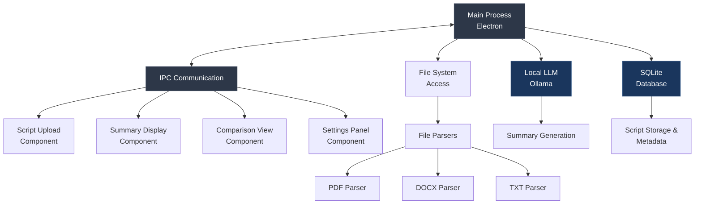

# Offline AI Script Summarizer Desktop App

A secure desktop application for film directors to analyze and summarize scripts using **local LLM (RAG) technology**, ensuring complete confidentiality of sensitive intellectual property.

## Purpose

This macOS desktop application enables film directors to efficiently evaluate multiple scripts while maintaining complete data privacy through local processing.

### Key Problems Solved

• **Script Confidentiality** - Process sensitive scripts entirely offline without external network calls, protecting intellectual property from potential leaks

• **Multi-Format Analysis** - Automatically parse and analyze scripts in PDF, TXT, and DOCX formats with comprehensive summaries including plot, characters, themes, and production considerations  

• **Efficient Script Comparison** - Compare multiple scripts side-by-side with structured summaries to make informed decisions about which projects to pursue

## System Architecture



## Quick Start

1. **Setup Development Environment**
   ```bash
   cd script-summarizer-app
   npm install
   npm run dev
   ```

2. **Run Tests**
   ```bash
   npm test
   npm run test:integration
   ```

3. **Build Application**
   ```bash
   npm run build
   npm run package
   ```

Please ensure all tests pass and follow the existing code style before submitting pull requests.