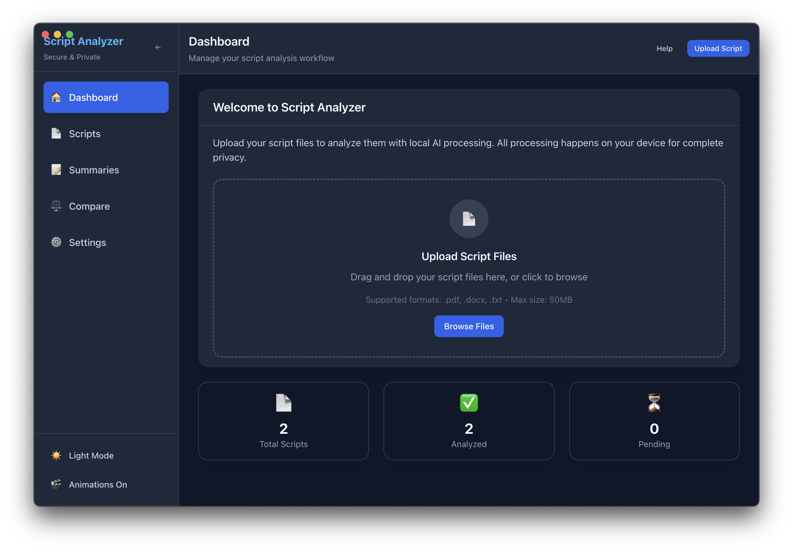
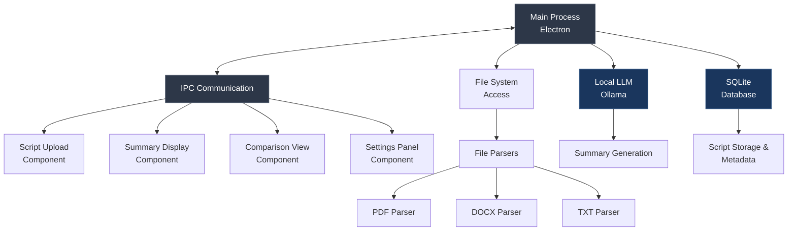

# Offline AI Script Summarizer Desktop App

A secure desktop application for film directors to analyze and summarize scripts using **local LLM (RAG) technology**, ensuring complete confidentiality of sensitive intellectual property.

## Purpose

This macOS desktop application enables film directors to efficiently evaluate multiple scripts while maintaining complete data privacy through local processing.

### Software UI



## Key Features

• Complete Privacy Protection and Offline Access
• Multi-Format Script Support (PDF, TXT, and DOCX)
• AI-Powered Summaries using local LLM
• Side-by-Side Script Comparison (rate, save note)
• Secure Local Storage
• Professional Interface - clean, intuitive - specifically for film industry professionals
• Export Capabilities
• Cross-Platform Ready (macos, windows and linux)

## System Architecture



## Installation

### Prerequisites

- Node.js (v18 or higher)
- npm or yarn package manager
- Ollama installed locally for LLM functionality
- gemma3:1b (or your desired model) is downloaded inside ollama and ready to use

### Environment Variable

```bash
OLLAMA_API_KEY=       # the api key from your ollama user account
OLLAMA_BASE_URL=      # http://localhost:11434 or the localhost where ollama is running
DEFAULT_MODEL=        # gemma3:1b or your desired model name
```

### Setup Instructions

1. **Clone the Repository**

   ```bash
   git clone https://github.com/jamiul-islam/film-script-offline-summarizer-ai-desktop-software.git
   cd film-script-offline-summarizer-ai-desktop-software
   ```

2. **Install Dependencies**

   ```bash
   npm install
   ```

3. **Setup Ollama**

   ```bash
   # Install Ollama (macOS)
   brew install ollama

   # Pull required model
   ollama pull gemma3:1b # or your desired model
   ```

4. **Start Development Server**

   ```bash
   npm run start
   ```

5. **Build for Production**
   ```bash
   npm run build
   npm run package
   ```

## Contributing

We welcome contributions from the community! This open-source project thrives on collaborative development.

### How to Contribute

- Fork the repository and create a feature branch
- Ensure all tests pass with `npm test`
- Follow existing code style and conventions
- Submit a pull request with clear description of changes
- Report bugs and suggest features through GitHub issues

### Development Guidelines

- Write comprehensive tests for new features
- Maintain TypeScript type safety
- Follow React best practices for UI components
- Ensure offline functionality remains intact

Made with ❤️ in Bogra, Bangladesh
